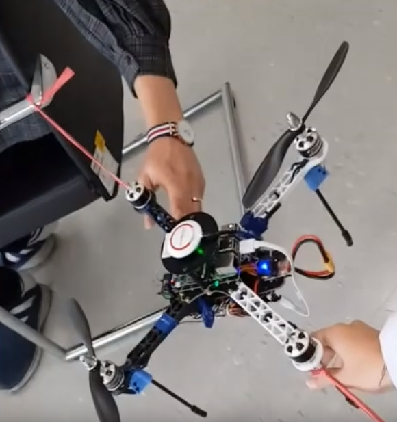
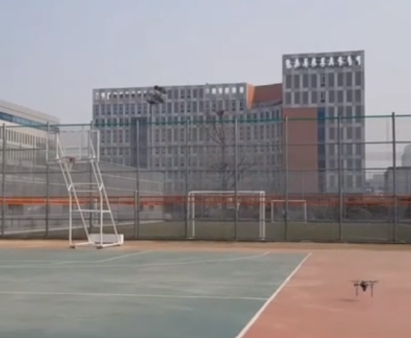

# PSO 알고리즘 기반 자율주행 드론  
* [동영상 링크](https://www.youtube.com/watch?v=be__jxvsqGE "유튜브")  
* 본 논문은 다양한 목적을 갖는 센서들이 분포한 환경에서 복수의 UAV 들을 이용하여 센서 데이터 정보를 최대로 획득할 수 있는 방법을 제안한다. 센서 네트워크 환경에서 센서가 가지고 있는 데이터를 획득하기 위해 UAV 들이 사용되며, UAV 들간의 데이터 전송을 위해 연결이 이루어져야 한다. 따라서 본 논문에서는 복수의 UAV 들의 연결을 유지하며, 다양한 종류의 센서 데이터 획득, 중복, 데이터 송, 수신 시 사용하는 링크의 상태를 고려한 효율적인 센서 데이터 정보를 최대로 획득할 수 있는 위치를 탐색하는 알고리즘을 제시한다.  
  
* 논문: 한국통신학회 학술대회논문집 2019년도 한국통신학회 동계종합학술발표회 논문집 2019.01 235 - 236 (2 pages)  
  
* 논문 링크: https://www.dbpia.co.kr/journal/articleDetail?nodeId=NODE08003286 

* 여러 번의 Iteration을 거쳐서 최적화 경로를 찾아내는 PSO (Partical Swarm Optimization) 알고리즘 기반으로 Matlab과 Matlab의 기능 중 GUI, App Designer 기능도 함께 사용해서 한 눈에 확인할 수 있는 유틸을 제작  

* 실제 드론과 드론의 통신, 드론과 노트북 사이의 통신을 리눅스 환경에서 개발  
* Ad-hoc 네트워크에 OLSR 알고리즘을 이용하여 IP 라우팅 기능과 Multi-hop Communication 구현  
* OLSR(Optimized Link State Routing Protocol) 은 모바일 애드혹 네트워크에 최적화된 IP 라우팅 프로토콜/ OLSR은 실제 데이터 전송 요청이 발생하기 전에 미리 경로를 계산하여 라우팅 테이블을 생성하는 프로액티브 방식 / 모바일 애드혹 네트워크상에서 주변 노드들을 발견하고 링크 상태 정보를 전파하기 위해 헬로(hello) 메시지를 사용한다. / 개별 노드들은 네트워크의 토폴로지 정보를 확보하여 다른 모든 노드들에 대해 데이터를 전달하기 위한 최단경로를 계산한다.  
* GPS로 위치를 지정하면 해당 위치로 드론이 자율주행하여 센서 정보를 Sensing 하는 코드를 구성  

  
  

### 멀티미디어 통신망 연구실 학부연구생 프로젝트  

           인하대학교 정보통신공학과 나호정  
           인하대학교 정보통신공학과 장성진  
           인하대학교 정보통신공학과 박광석  
           인하대학교 정보통신공학과 최유진  
           인하대학교 정보통신공학과 유상조 교수님  
